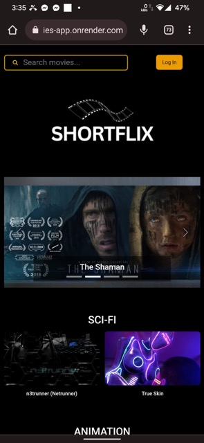
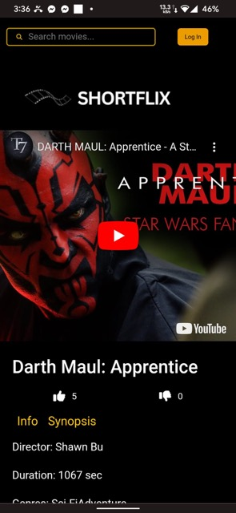
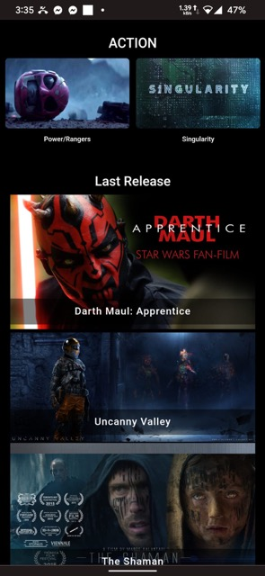

## Project Brief

The Shortflix Blog is a web application that allows users to share and discover information about their favorite movies. Users can create accounts, browse through a collection of movies, read and write reviews, and interact with other movie enthusiasts through comments and likes.

[Demo](https://shortflixmovies-app.onrender.com/)

## Intefaz View

## Key Features

- [ ] User Authentication: Allow users to sign up, log in, and manage their accounts.
- [x] Movie Database: Maintain a database of movies with details such as title, release year, genre, director, and synopsis.
- [x] Display Movie by genres like Sci-fi, action, animation.
- [x] Display Movie by Last release.
- [ ] Movie Reviews: Enable users to write reviews for movies they have watched and provide ratings.
- [ ] Movie Search: Implement a search functionality that allows users to find movies based on title, genre, or director.
- [ ] User Interactions: Allow users to comment on movie reviews, like reviews, and follow other users.
- [ ] User Profile: Provide users with a profile page where they can view and edit their information, manage their reviews, and see their activity history.
- [ ] Trending Movies: Display a list of popular and trending movies based on user ratings and reviews.
- [x] Responsive Design: Ensure that the application is accessible and user-friendly on different devices and screen sizes.

## Technology Stack

The project will be developed using the MERN stack, which includes the following technologies:

- Frontend: React.js, Boostrap , FontAwesomeIcon ,building the user interface.
- Backend: Node.js with Express.js for handling server-side logic and API endpoints.
- Testing: Jest, Supertest
- Database: MongoDB for storing movie data, user information, and user interactions.
- Authentication: JSON Web Tokens (JWT) for user authentication and session management.

## Project Plan:

1. Requirement Gathering: Define the scope and features of the project. Gather detailed requirements and create user stories.
2. Database Design: Design the MongoDB schema for movies, users, reviews, comments, and other necessary collections.
3. Backend Development:

   - Set up the Node.js and Express.js server.
   - Implement RESTful APIs for user authentication, movie CRUD operations, review management, and user interactions.
   - Integrate the APIs with the MongoDB database using an Object Data Modeling (ODM) library like Mongoose.

4. Frontend Development:

   - Create a React.js application with necessary components for user registration, login, movie browsing, review submission, etc.
   - Integrate the frontend with the backend APIs to fetch and display data.
   - Implement user interfaces for profile management, user interactions, and search functionality.

5. Testing: Perform unit testing for both frontend and backend components. Conduct integration testing to ensure proper communication between frontend and backend.

   - Deployment and Hosting:
   - Set up the production environment for the application.

6. Deploy the backend server to a hosting platform.
7. Deploy the frontend application to a static hosting platform (e.g., Netlify or Vercel).

   - Configure the necessary environment variables and ensure the application runs smoothly in the production environment.

8. User Acceptance Testing: Involve stakeholders to test the application and gather feedback for further improvements.

   - Bug Fixing and Refinement: Address any reported bugs and make necessary refinements based on user feedback.

9. Final Deployment: Deploy the refined application to the production environment for public acces

## References Links

[Short Film Json](https://github.com/vankasteelj/json-shorts/blob/master/api.json) by
